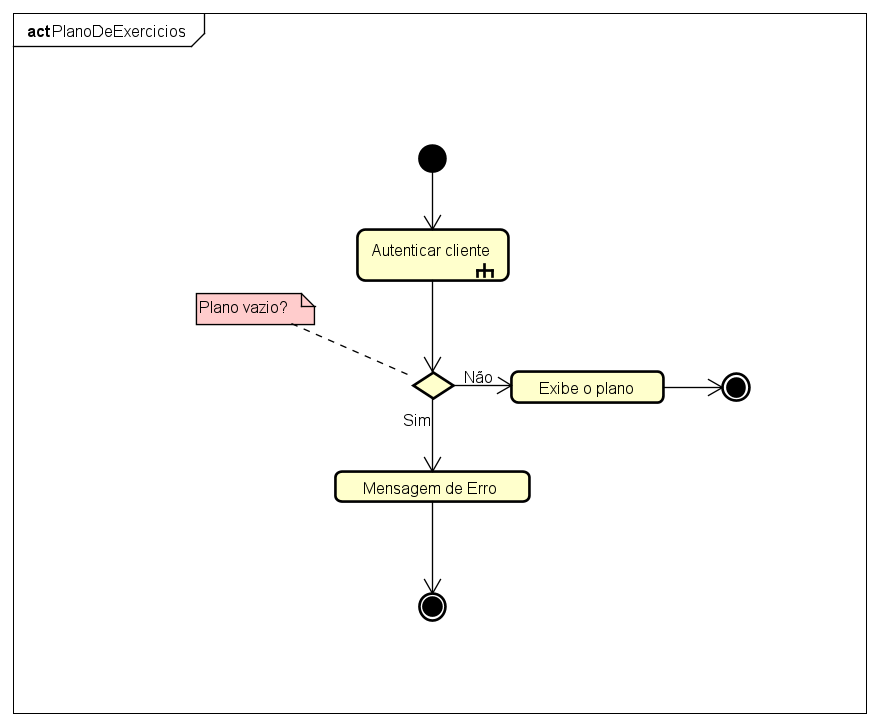

# Academia Power Pump

## Configuração

Antes de rodar o programa, é necessário configurar o arquivo `.env` com um `MONGO_URI`. Siga os passos abaixo:

1. Crie um arquivo chamado `.env` na pasta do projeto.
2. No arquivo `.env`, defina a variável `MONGO_URI` com a URI de conexão ao banco de dados MongoDB que você deseja usar. Por exemplo:
   ```
   MONGO_URI=mongodb+srv://<login>:<senha>@cluster0.5ljbs7k.mongodb.net/?retryWrites=true&w=majority
   ```
você encontrará esse comando no site do MongoDB
Defina também, `JWT_SECRET`, `ADM_USER`, `ADM_PASS`

## Instalação

Para instalar as dependências necessárias, abra o terminal na pasta do projeto e execute o seguinte comando:

```
npm install
```

## Execução

Após instalar as dependências, você pode iniciar o servidor executando o seguinte comando:

```
npm start
```

O servidor será iniciado e estará pronto para atender as requisições.

Certifique-se de que o MongoDB esteja em execução e acessível com a URI fornecida no arquivo `.env`.

## Diagramas
### Casos de uso

### Classe

### Diagramas de atividade

#### Autenticar usuário


#### Gerencia Exercícios


#### Gerencia Pagamentos


#### Gerencia Aulas


#### Gerenciar Equipamentos


#### Logar administrador e personal trainer


#### Visualizar plano de exercícios
